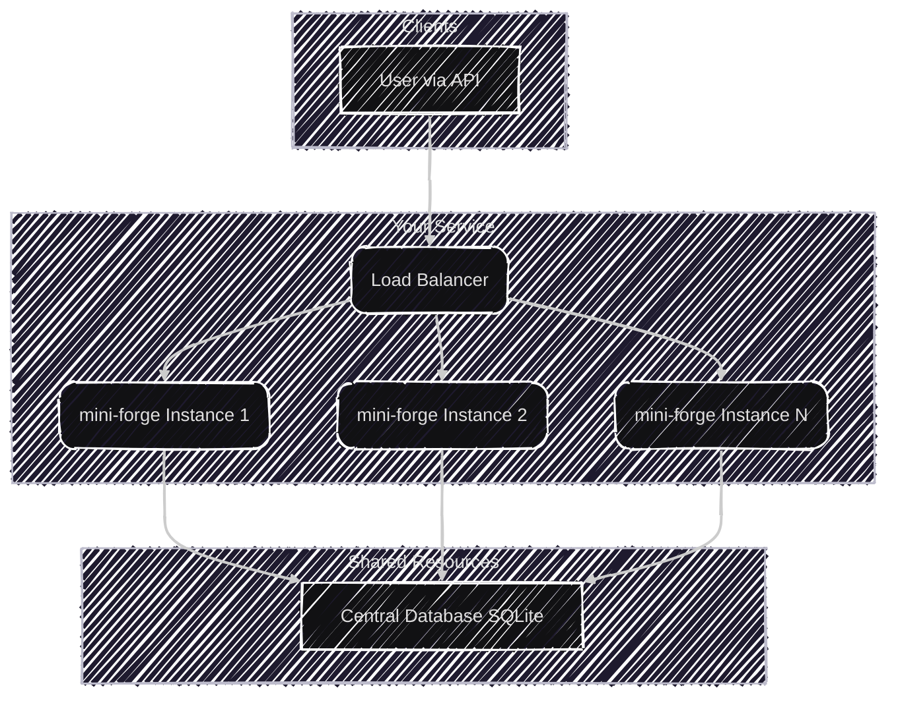

# mini-forge

A lightweight, high-performance, and scalable Key Generation Service (KGS) written in Go. Designed for distributed systems that require a steady stream of short, unique, and collision-free keys.

## ✨ Key Features

*   High-Performance: Serves pre-generated keys directly from an in-memory pool, eliminating database contention on read operations.
    
*   Scalable & Distributed-Ready: Multiple instances can run concurrently without generating duplicate keys, thanks to a centralized range-based counter.
    
*   Collision-Free by Design: Guarantees unique keys across all instances by using a transactional database mechanism to reserve blocks of numbers for key generation.
    
*   Concurrent-Safe: Built to handle thousands of simultaneous requests safely using a channel-based key pool and atomic database operations.
    

## ⚙️ How It Works

The service is designed to avoid the typical bottlenecks of a traditional KGS. Instead of hitting the database for every key request, it generates keys in batches and serves them from memory.

1.  Range Reservation: When a mini-forge instance needs new keys, it requests a unique range of numbers from the database. It does this in a transaction using a `SELECT ... FOR UPDATE` lock to ensure no two instances can get the same range. The size of this range is configurable via the RANGE\_SIZE setting.
    
2.  Key Generation: The service then generates keys for every number in its reserved range using a Base62 encoding strategy. This creates short, URL-friendly strings.
    
3.  In-Memory Pool: These generated keys are stored in an in-memory channel that acts as a key pool.
    
4.  Serving Keys: When a client requests a key, the service simply takes one from the in-memory pool—a very fast operation.
    
5.  Automatic Refill: A background goroutine continuously monitors the size of the key pool. When the number of available keys drops below a certain threshold, it automatically fetches a new range from the database and refills the pool, ensuring there's always a ready supply of keys.
    

This architecture minimizes database interaction, making the service extremely fast and scalable.



## 🚀 Getting Started

### Prerequisites

*   Go 1.19 or higher
    
*   SQLite3
    

### Configuration

The service is configured using a config.yml file, with values populated by environment variables.

1.  Create a .env file in the root directory by copying the example:  
    cp .env.example .env  
      
    
2.  Edit the .env file with your configuration:  
    ```bash
    # The port the HTTP server will listen on  
    PORT=8080  
      
    # The number of keys to pre-generate and pool in memory at a time.  
    # A larger range size means fewer database queries but higher initial memory use.  
    RANGE_SIZE=1000  
      
    # Set to true to enable detailed debug logging  
    DEBUG_ENABLED=false  
      
    # Absolute or relative path to the configuration file  
    CONFIG_PATH=./config/config.yml 
    ``` 
      
    

### Build and Run

1.  Clone the repository:  
    ```bash
    git clone https://github.com/jassi-singh/mini-forge.git
    cd mini-forge  
    ```
      
    
2.  Install dependencies:  
    ```bash
    go mod download  
    ```
      
    
3.  Run the service:  
    ```bash
    go run main.go  
      
    #Or build a binary and run it:  
    go build -o mini-forge  
    ./mini-forge  
    ```
    

The service will start on the port configured in your .env file.

## API Usage

The service exposes a single, simple endpoint for retrieving a key.

### GET /get-key

Returns a unique, Base62-encoded key.

Example Request:
```bash
curl http://localhost:8080/get-key 
``` 
  

Success Response (200 OK):
```bash
000001a  
```
  

## 🧪 Testing the Service

The project includes a comprehensive concurrency test to simulate a high-traffic environment and ensure no duplicate keys are ever generated.

### ⚠️ Important: System Limits for Concurrent Testing

When running tests with thousands of concurrent workers, you may hit your system's file descriptor limit. This can cause "too many open files" errors.

**Check your current limit:**
```bash
ulimit -n
```

**Temporarily increase the limit (for the current session):**
```bash
# Increase to 10,000 file descriptors
ulimit -n 10000
```

**For macOS users, you may need to check both soft and hard limits:**
```bash
# Check soft limit
ulimit -Sn

# Check hard limit
ulimit -Hn

# Set to the hard limit or a specific value
ulimit -Sn 10000
```

> **Note:** The required limit depends on the number of concurrent workers in your test. For very high concurrency (10,000+ workers), you may need to increase this further.

#### Running the Test

```bash
# Run all tests, including the concurrency test  
go test -v ./...  
  
# Run with a longer timeout if needed  
go test -v -timeout 30s ./internal/api\_handlers/  
```
  

The test simulates thousands of concurrent requests and verifies that every single key received is unique. This is crucial for validating the service's reliability for production use.

## 🔥 Load Testing with k6

The project includes a k6 load test script to simulate realistic production traffic across multiple service instances and verify key uniqueness under high load.

### Prerequisites

Install k6 on your system:

**macOS:**
```bash
brew install k6
```

**Linux:**
```bash
# Debian/Ubuntu
sudo gpg -k
sudo gpg --no-default-keyring --keyring /usr/share/keyrings/k6-archive-keyring.gpg --keyserver hkp://keyserver.ubuntu.com:80 --recv-keys C5AD17C747E3415A3642D57D77C6C491D6AC1D69
echo "deb [signed-by=/usr/share/keyrings/k6-archive-keyring.gpg] https://dl.k6.io/deb stable main" | sudo tee /etc/apt/sources.list.d/k6.list
sudo apt-get update
sudo apt-get install k6
```

**Windows:**
```bash
choco install k6
```

For other platforms, visit: https://k6.io/docs/get-started/installation/

### Running Multiple Service Instances

To properly test the distributed nature of mini-forge, you should run multiple instances simultaneously:

**Terminal 1:**
```bash
PORT=8080 go run main.go
```

**Terminal 2:**
```bash
PORT=8081 go run main.go
```

**Terminal 3:**
```bash
PORT=8082 go run main.go
```

> **Note:** All instances will share the same database (configured in `config.yml`), which is essential for testing the distributed range allocation mechanism.

### Running the Load Test

The automated script handles both running the test and analyzing results:

```bash
chmod +x run_test_and_analyze.sh
./run_test_and_analyze.sh
```

This script will:
1. Execute the k6 load test against all running instances
2. Capture all generated keys
3. Analyze for duplicate keys
4. Display a comprehensive summary

### Load Test Configuration

The k6 test (`k6_load_test.js`) uses a ramping VU (Virtual User) pattern:

- **Stage 1:** Ramp up to 50 users over 30 seconds
- **Stage 2:** Ramp up to 1,000 users over 30 seconds
- **Stage 3:** Ramp up to 2,000 users over 30 seconds
- **Stage 4:** Ramp down to 0 users over 30 seconds

**Performance Thresholds:**
- HTTP failure rate must be < 1%
- 95th percentile response time must be < 200ms

You can modify these settings in `k6_load_test.js` to suit your testing needs.

### Understanding the Results

After the test completes, you'll see output like:

```
============================================================
          KEY UNIQUENESS TEST RESULTS
============================================================

Total Keys Generated:  458089
Unique Keys:           458089
Duplicate Keys Found:  0

✅ SUCCESS: All keys are unique!

============================================================

📁 All keys saved to: results.log
📁 Full test output saved to: test_output.log
```

**Key Metrics:**
- **Total Keys Generated:** Total number of keys returned by all instances
- **Unique Keys:** Number of distinct keys (should match total)
- **Duplicate Keys Found:** Number of keys that appeared more than once (should be 0)

If duplicates are found, the script will display the first 20 duplicate keys with their occurrence counts.

### Manual k6 Execution

You can also run k6 directly without the analysis script:

```bash
k6 run k6_load_test.js
```

This provides real-time performance metrics but doesn't perform duplicate key analysis.
